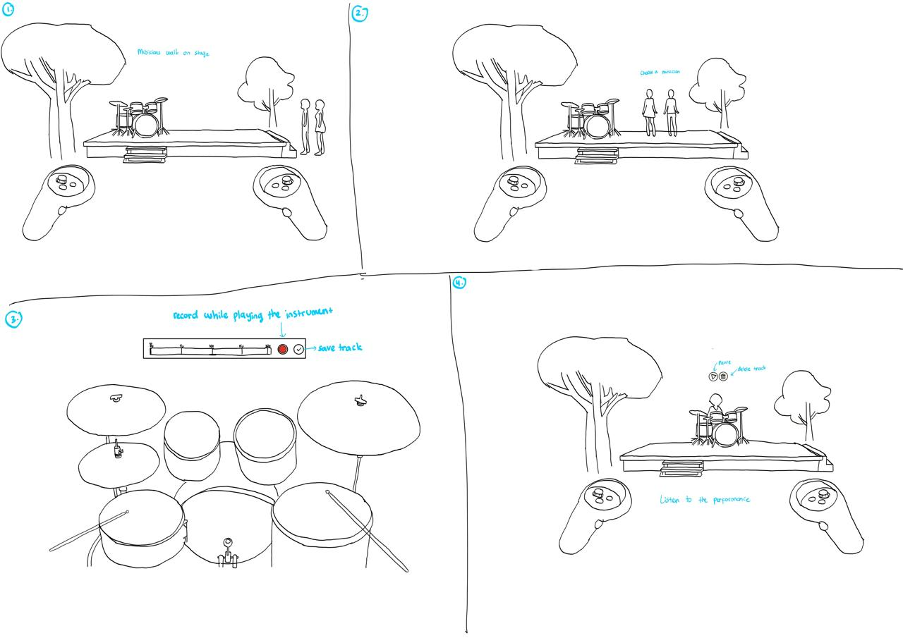

# Design Activity

At the beginning of this project, my concept was a 3D drawing experience where users could create a drawing and then view it at a much larger scale, almost as if they were entering their own artwork. I developed a paper prototype for this idea and tested basic tools such as drawing, changing colours, erasing, undo, and redo. The testing helped me understand the importance of clear icons and familiar interactions, especially when the participant misunderstood my cube-shaped eraser icon as a tool for adding a 3D object.

Although the testing gave me useful feedback, I started to feel unsure about continuing with the concept. The idea used VR to change the scale of a drawing, but most of the interaction still depended on selecting tools and drawing in a similar way to an existing 2D application. I wanted to explore something that used the VR controllers and the user's physical movement more directly. Because of this, I decided not to continue refining the drawing interface and began brainstorming a new direction.

## Exploring a New Direction

I started thinking about applications that could become more immersive when redesigned for VR. This led me to GarageBand, because creating music already involves movement, timing, sound, and performance. In the existing application, users select virtual instruments and tap controls on a flat screen. I became interested in how this could change if the user could physically perform the music inside a virtual environment.

My first GarageBand VR idea focused on a virtual piano. The user would hold two controllers and use them to press the piano keys. This seemed straightforward, but after thinking about it further, I felt that it would still be similar to tapping buttons on a screen. The controls would be placed in a 3D space, but the interaction itself would not change very much.

Afterwards, I considered other instruments that could make better use of movement. A violin could use a bowing action, while a guitar or bass could use strumming. These ideas appeared more physical, but they would also be difficult to represent convincingly with standard VR controllers. Playing these instruments normally depends on precise finger placement, but even then, the interaction might feel confusing and inaccurate.

Eventually, drums became the strongest option because I found that the movements involved in playing them matched the available VR equipment well. A drummer uses two drumsticks, and the user has two hand controllers. Each controller could therefore become a virtual drumstick without requiring the user to learn an unfamiliar gesture. The user could hit different drum surfaces, hear an immediate sound, and create a rhythm through natural two-handed movement.

## Developing the Experience

Once I chose drumming as the main interaction, I began thinking about how the experience could feel like more than a basic VR drum simulator. I wanted to keep a connection to GarageBand's purpose of recording and arranging music, while also creating the feeling of being part of a performance.

This led to the idea of placing the user in an outdoor garden performance area. When the experience begins, the user stands in front of a stage and selects a virtual musician. The selected musician is highlighted so the user knows that their choice has been recognised. After selecting the musician, the user is moved to a seated position behind a drum kit.

The two VR controllers then appear as drumsticks. Before recording, the user can hit the different drum surfaces to learn which sounds they produce. When ready, the user presses a record button and performs a short rhythm. The system records both the drum sounds and the timing of each hit.

After finishing the recording, the user can choose to save it or record it again. If the user clicks the save button, the track is saved immediately, and they return to the front of the stage to watch the selected musician replay the recorded rhythm using a simple drumming animation. The user can pause the performance or delete the track to create a new one.

## Storyboard Development

To visualise how the user would move through the experience, I created a storyboard showing the main stages of the interaction. The storyboard begins with the user standing in front of the outdoor stage and selecting a virtual musician. The user is then moved behind the drum kit, where the two VR controllers become virtual drumsticks.

The next frames show the user testing the drum sounds, recording a short rhythm, and choosing whether to save it or record again. After saving the recording, the user returns to the front of the stage and watches the selected musician replay the rhythm. Creating this storyboard helped me organise the order of the interactions and consider what the user would see at each stage of the experience.

# Conclusion
So far, this design process has helped me develop a clearer direction for my VR concept. Although I changed my idea several times at the beginning, I think it was still a useful part of the process. Exploring and brainstorming different directions helped me find a concept that felt more suitable, rather than choosing an idea too quickly and later realising that it did not work for me.

The work from my previous concept was also not wasted. Creating and testing the paper prototype showed me that I should not assume users will automatically understand an icon or interaction. I can apply this lesson to my new concept by testing whether users understand how to select a musician, use the recording controls, and recognise the controllers as drumsticks. If users experience difficulty, I could add brief instructions or visual hints within the VR environment to help them understand what to do.

## AI ACKNOWLEDGEMENT

| Tool | Use | Prompts | Section | Date |
|---|---|---|---|---|
| ChatGPT | Used to improve grammar, sentence flow, and the organisation of my design activity process while keeping my original ideas and reflections. | “Refine the grammar and flow of my design activity process without changing my original ideas or writing style.” | All sections | 13 August 2026 |