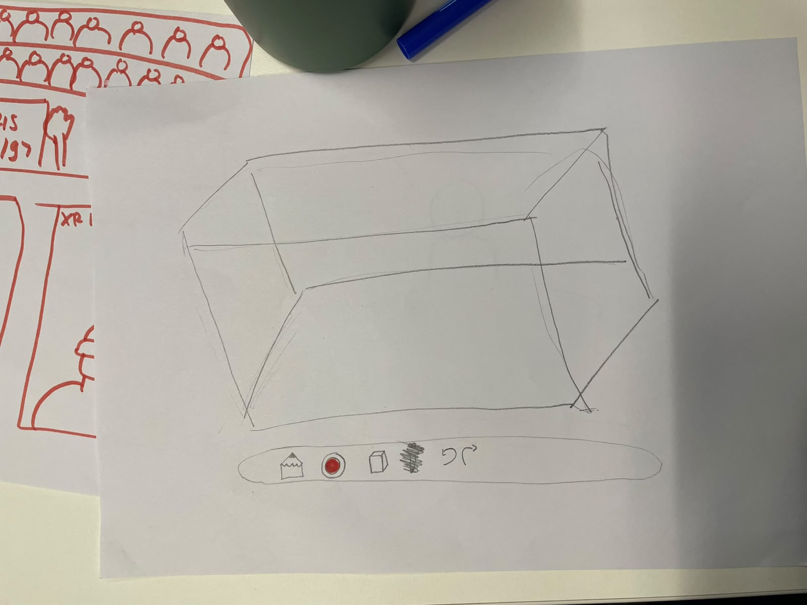

# Week 2 Studio Reflection 
### 06/08/26

In today's studio session, I brainstormed and selected my VR concept, which focuses on creating a 3D drawing experience where users can view and interact with their own drawings at a larger scale, almost as if they are entering their own artwork. Through brainstorming different ideas, I realised that this concept could explore how VR can transform traditional 2D drawing into a more immersive and spatial experience. To test my idea, I created a paper prototype that represented the potential VR environment and interface, including the placement of buttons, icons, and drawing tools. The prototype showed how users might interact with features such as drawing, changing pencil colours, erasing, and using the undo and redo functions. 

I conducted a qualitative usability test by asking a participant to complete several tasks using the paper prototype. I gave the participant one task at a time and asked them to use their finger to simulate interacting with the VR interface. They pointed to and pressed the hand-drawn buttons and traced the steps they would take to complete each task. The tasks included drawing a simple shape, changing the pencil colour, erasing part of the drawing, and using the undo and redo functions. During the testing process, I observed how the participant interacted with the prototype, whether they could understand the functions independently, and whether the icons and button placements were clear enough without additional explanation. I collected qualitative data through observation and feedback, including whether the participant successfully completed each task, where they experienced confusion or hesitation, and their opinions about the clarity of the interface design. 

One important issue occurred during the erasing task. The participant could not identify the eraser because I had represented it with a cube-shaped icon. Instead of recognising it as an eraser, they assumed that the icon was used to add a 3D shape to the drawing. This showed that the icon did not communicate its intended function clearly. From this testing, I learned that an interaction that seems obvious to the designer may be interpreted differently by a user. The confusion surrounding the eraser icon also demonstrated the importance of testing design assumptions early, as even a small decision, such as an icon’s shape can significantly affect the usability of the overall experience.

The most important advice I would give myself and others for the next testing session is to avoid explaining the interface before the participant attempts the tasks. This can produce more accurate findings about whether the design is genuinely intuitive. I would also encourage participants to think aloud so I can better understand the reasons behind their decisions. In future testing, I would include more participants to determine whether my future design decisions are understandable to a wider range of users.

For my next prototype, I would create an improved version of the paper prototype based on the findings from this testing session. I would redesign the unclear eraser icon and refine the placement of the drawing tools before testing the interface again with more participants. Overall, this testing session helped me move beyond evaluating the visual appeal of the concept and consider whether users could understand the function of each tool from its icon and identify the steps needed to complete each task without additional explanation. It showed me that a VR interface needs clear and familiar icons so users can understand the function of each tool and the steps required to complete a task.

